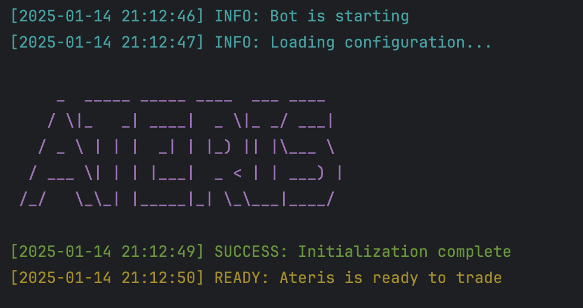

# NeuralTrader: A Solana Trading Bot Leveraging AI (Beta)

NeuralTrader is an advanced trading bot designed to automate token trading on the Solana blockchain. By utilizing cutting-edge AI and neural networks, it provides predictive market insights, real-time sentiment analysis, and adaptable strategies for traders. NeuralTrader is optimized to respond dynamically to market conditions, enhancing profitability through advanced reinforcement learning models.

## Key Features

- **AI-Powered Insights**: Leverages neural networks for market trend prediction and sentiment analysis.
- **Real-Time Automation**: Executes trades automatically based on user-defined parameters and real-time market data.
- **Customizable Strategies**: Flexible configuration to match diverse trading strategies.
- **Robust Security**: Ensures private key integrity and secure interactions with Solana's decentralized ecosystem.

---

## Setup

To begin using NeuralTrader:

1. **Create a Wallet**:
   - Set up a new Solana wallet and fund it with SOL.
2. **Token Conversion**:
   - Convert SOL to USDC or WSOL, depending on your configuration.
3. **Configure the Environment**:
   - Update the `.env.copy` file with your details and rename it to `.env`.
4. **Install Dependencies**:
   - Run `npm install` to install necessary packages.
5. **Start the Bot**:
   - Execute `npm run start` in your terminal.

You should see output similar to this:

---

## Configuration Guide

### Wallet
- **PRIVATE_KEY**: Your wallet\u2019s private key for executing transactions.

### Network Connection
- **RPC_ENDPOINT**: The HTTPS RPC endpoint for Solana network interactions.
- **RPC_WEBSOCKET_ENDPOINT**: WebSocket endpoint for real-time updates.
- **COMMITMENT_LEVEL**: Transaction commitment level (e.g., "finalized").

### Bot Behavior
- **LOG_LEVEL**: Set the logging level (e.g., `info`, `debug`, `trace`).
- **ONE_TOKEN_AT_A_TIME**: Limits the bot to process one token at a time.
- **COMPUTE_UNIT_LIMIT** and **COMPUTE_UNIT_PRICE**: Parameters for transaction fee calculations.
- **PRE_LOAD_EXISTING_MARKETS**: Option to cache existing markets at startup (not recommended for public RPC).
- **CACHE_NEW_MARKETS**: Cache new markets discovered during runtime.
- **TRANSACTION_EXECUTOR**: Choose `warp` or `jito` for transaction execution.
- **CUSTOM_FEE**: Specify a custom fee for transactions (recommended: \u22650.006 SOL).

### Trading Parameters

#### Buying
- **QUOTE_MINT**: Choose between USDC or WSOL for sniping pools.
- **QUOTE_AMOUNT**: Define the amount to allocate per token.
- **AUTO_BUY_DELAY**: Delay before executing a purchase (in ms).
- **BUY_SLIPPAGE**: Define allowable slippage percentage.

#### Selling
- **AUTO_SELL**: Enable or disable automated selling.
- **TAKE_PROFIT** and **STOP_LOSS**: Configure profit and loss thresholds (in %).
- **SELL_SLIPPAGE**: Define slippage percentage for sales.

#### Snipe List
- **USE_SNIPE_LIST**: Enable targeting specific tokens listed in `snipe-list.txt`.
- **SNIPE_LIST_REFRESH_INTERVAL**: Frequency of refreshing the snipe list (in ms).

#### Filters
- Configure filters such as:
  - Checking for token mutability, socials, or renounced mints.
  - Pool size constraints.
  - Burn and freeze statuses.

---

## Advanced Features: Warp Transactions (Beta)

For improved transaction performance and reduced failures, NeuralTrader supports Warp Transactions. This service enables optimized transaction execution through third-party providers.

### Security
Your private key remains secure and is not transmitted during transaction processing.

### Fees
Transaction fees are shared between Warp developers and third-party providers. Failed transactions do not incur any charges.

---

## Common Issues

### Unsupported RPC Node
If your RPC node lacks required methods, consider switching to alternatives like Helius or QuickNode.

### Missing Token Account
Ensure your wallet holds the required USDC or WSOL for trading.

---

## Contact & Support

- Visit our [website](https://neuraltrader.io).
- Follow us on [Twitter](https://x.com/neuraltradersol).

---

## Disclaimer
NeuralTrader is provided as-is for educational purposes. Trading cryptocurrencies involves significant risk. Users are solely responsible for any losses incurred while using the bot.
